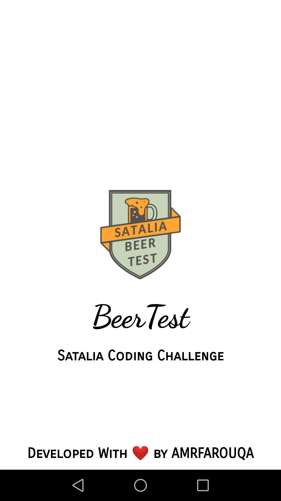
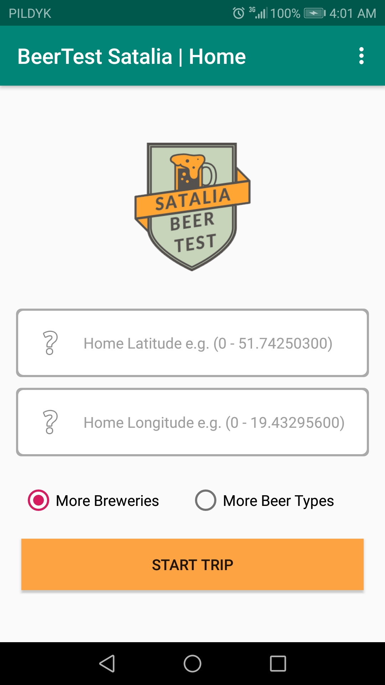
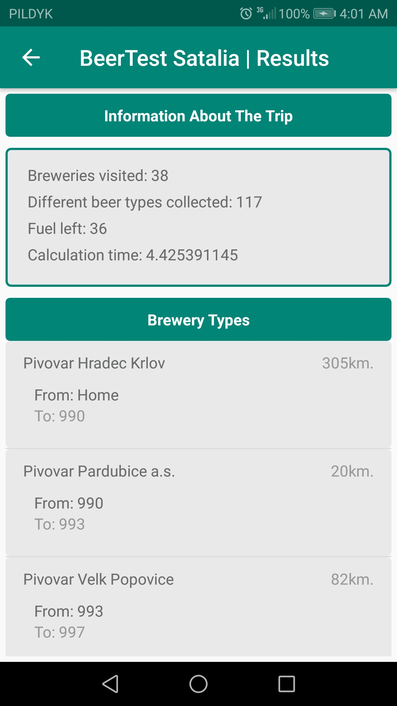

# Beertest - SATALIA
Coding Challenge Android Implementation

 

You are a crazy beer-fanatic millionaire. It's the weekend. Your location is LONG/LAT. You have a perfect helicopter with enough fuel to fly 2000 kilometers. You have an idea to visit as many beer factories within that distance as you can and collect as many beer types as you can for your party this weekend.

Program accepts following inputs:
 - Home location (latitude, longitude)
 - Priority (breweries or beer types)
 
 Program uses SQLite to run MySQL inside the Android App. Internet Connection is not Required.
 
# Requirements:
 - Android Studio
 - Emulator or Physical Device
 
# Usage
Install Android Studio, clone the project and do following steps:
 - Option 1: Run app from Android Studio to Emulator or Physical Device.
 - Option 2: Copy generated APK, located in "app/debug" or "app/release", to your physical device and install the app from it.

  
   
  

  
   
  

  
   
   

